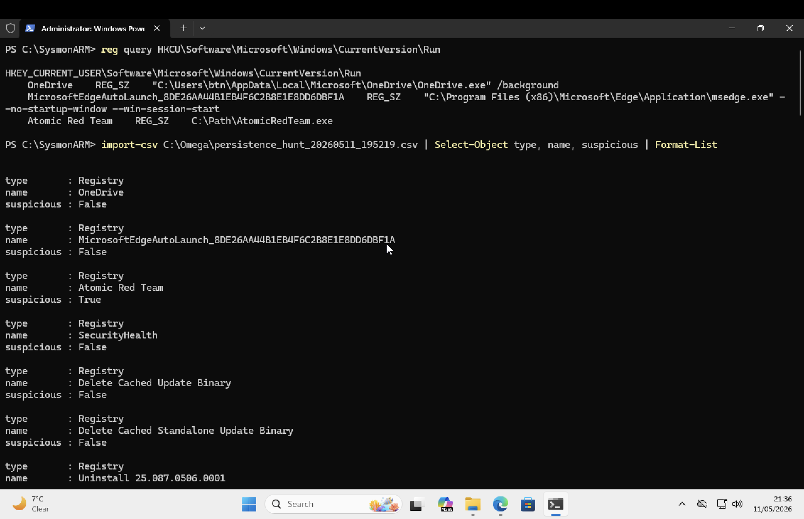
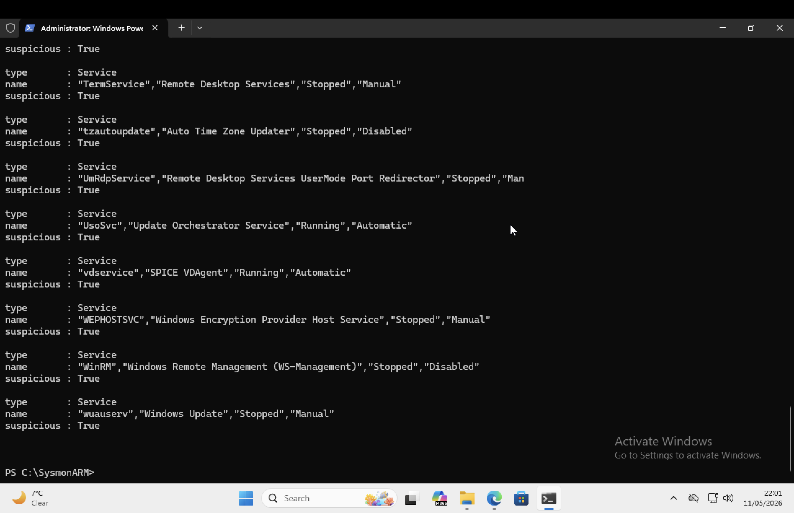

# Windows-Persistence-Hunting-T1547.001
MITRE ATT&amp;CK T1547.001 – Registry persistence detection using Atomic Red Team and Python
<!--
  Project 1 – Windows Persistence Hunting (T1547.001)
  Professional GitHub README – fully formatted, no broken sections.
-->

# 🔍 Windows Persistence Hunting (T1547.001)

[](https://attack.mitre.org/techniques/T1547/001/)
[](https://github.com/redcanaryco/atomic-red-team)
[](https://python.org)
[](https://learn.microsoft.com/en-us/powershell/)
[](https://microsoft.com)
[](#license)

<p align="center">
  <i>Detect registry‑based persistence on Windows using MITRE T1547.001</i>
</p>

---

## 📖 Table of Contents

1. [Abstract](#abstract)
2. [Environment](#environment)
3. [Attack Simulation](#attack-simulation)
4. [Hunting & Detection](#hunting--detection)
5. [Log Analysis](#log-analysis-cysa-focus)
6. [MITRE ATT&CK Mapping](#mitre-attck-mapping)
7. [Results & Evidence](#results--evidence)
8. [Files](#files-in-this-repository)
9. [Next Steps](#next-steps)
10. [Author](#author)

---

## 📌 Abstract

This project simulates a **registry‑based persistence** attack (MITRE ATT&CK T1547.001) on Windows 11 ARM64 using **Atomic Red Team**.  
Detection is performed through:

- ✅ Manual registry inspection  
- ✅ Automated Python scanning (7 persistence locations)  
- ✅ Windows Event Log analysis (PowerShell Event ID 4104)

All findings are reproducible and aligned with **log analysis objectives**.

---

## 🖥️ Environment

| Component | Specification |
| :--- | :--- |
| **Operating System** | VM Windows 11 ARM64 On MacOS UTM|
| **User Privileges** | Non‑administrator (UAC enabled) |
| **Network** | Isolated lab environment |
| **Tools** | Atomic Red Team v1.0, Python 3.14, PowerShell 5.1 |

---

## Attack Simulation

### Atomic Red Team (T1547.001)

```powershell
Import-Module "C:\AtomicRedTeam\invoke-atomicredteam\Invoke-AtomicRedTeam.psd1" -Force
Invoke-AtomicTest T1547.001 -TestNumbers 1


## Attack Simulation

### Atomic Red Team (T1547.001)

```powershell
Import-Module "C:\AtomicRedTeam\invoke-atomicredteam\Invoke-AtomicRedTeam.psd1" -Force
Invoke-AtomicTest T1547.001 -TestNumbers 1
```

**What this does:**  
Adds a registry value under:

```text
HKCU\Software\Microsoft\Windows\CurrentVersion\Run
AtomicRedTeam → C:\AtomicRedTeam\...\AtomicRedTeam.exe
```

✅ Simulated adversary behaviour successfully.

---

## 🔍 Hunting & Detection

### 1. Manual Detection

```powershell
reg query HKCU\Software\Microsoft\Windows\CurrentVersion\Run
```

**Output:**

```text
HKEY_CURRENT_USER\...\Run
    AtomicRedTeam    REG_SZ    C:\AtomicRedTeam\...
```

### 2. Automated Python Scanner

| Location Type | Number Scanned |
| :--- | :--- |
| Registry persistence keys | 7 |
| Startup folders | 3 |
| Scheduled tasks | All |
| Windows services | All |
| WMI subscriptions | All |

**CSV output extract:**

```csv
type,location,name,suspicious
Registry,HKCU\...\Run,Atomic Red Team,True
```

> `suspicious = True` → **positive detection**

---

## Log Analysis Focus

### PowerShell ScriptBlock Logging (Event ID 4104)

Without Sysmon, Windows logs still captured the execution:

```powershell
Get-WinEvent -FilterHashtable @{
    LogName='Microsoft-Windows-PowerShell/Operational'
    ID=4104
} | Where-Object {$_.Message -like "*AtomicRedTeam*"}
```

**Captured artifact:**  
`reg add HKCU\...\Run /v AtomicRedTeam /t REG_SZ /d C:\...`

| Event ID | Log Name | Forensic Value |
| :--- | :--- | :--- |
| 4104 | PowerShell Operational | Full script block |
| 4657 | Security (audit enabled) | Registry value change |
| 4688 | Security | Process creation (`reg.exe`) |

---

## 📈 MITRE ATT&CK Mapping

| Tactic | ID | Technique |
| :--- | :--- | :--- |
| **Persistence** | TA0003 | T1547.001 (Boot or Logon Autostart Execution) |

---

## 📸 Results & Evidence

| Evidence | Status |
| :--- | :--- |
| Manual `reg query` confirms key | ✅ |
| CSV output shows `suspicious = True` | ✅ |
| PowerShell Event ID 4104 logged | ✅ |

### Screenshots

<p align="center">
  
  
</p>

---

## 📁 Files in This Repository

| File | Description |
| :--- | :--- |
| `module1_persistence.py` | Python persistence scanner |
| `persistence_hunt_YYYYMMDD_HHMMSS.csv` | Raw detection output |
| `screenshot_registry.png` | Registry evidence |
| `screenshot_csv.png` | CSV output |
| `README.md` | This document |


---


> **⚠️ Platform Note (ARM64):**  
> Sysmon driver installation encountered compatibility issues on the **Windows 11 ARM64** lab environment (Apple Silicon / UTM).  
> **Despite this**, the persistence mechanism was still successfully detected using:  
> - Manual registry inspection  
> - Native PowerShell ScriptBlock Logging (Event ID 4104)  
> - Custom Python scanner (7 persistence locations, no Sysmon required)  
>
> ✅ **The hunting methodology remains fully reproducible and valid on any standard x64 Windows system.**


## Next Steps

This is **Project 1** of the **Omega Protocol** — a 10‑project threat hunting series.


---

## 👤 Author

**Turhan Acar**  
[](https://github.com/btncwn)


---

## 📜 License

**Educational Use Only**  
Do not deploy on production systems without explicit authorisation.
